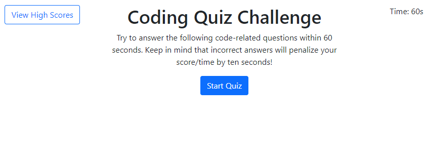
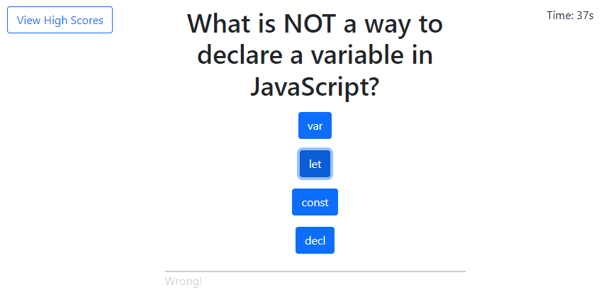
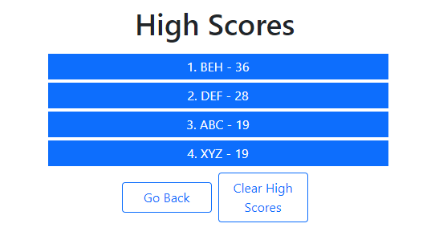

# JavaScript Quiz

## Description

This application is a brief exercise in writing a simple, timed coding quiz to demonstrate skill in producing dynamically updated HTML and CSS.

The following User Story and Acceptance Criteria were provided in the assignment requirements:

## User Story

```
AS A coding boot camp student
I WANT to take a timed quiz on JavaScript fundamentals that stores high scores
SO THAT I can gauge my progress compared to my peers
```

## Acceptance Criteria

```
GIVEN I am taking a code quiz
WHEN I click the start button
THEN a timer starts and I am presented with a question
WHEN I answer a question
THEN I am presented with another question
WHEN I answer a question incorrectly
THEN time is subtracted from the clock
WHEN all questions are answered or the timer reaches 0
THEN the game is over
WHEN the game is over
THEN I can save my initials and score
```

## Built With

-   HTML
-   CSS
-   JavaScript

## Website

<https://thorulfr.github.io/javascript-quiz/>

## Screenshots

### Landing Page



### Quiz



### High Scores



## Contribution

Code by Benjamin Holt
